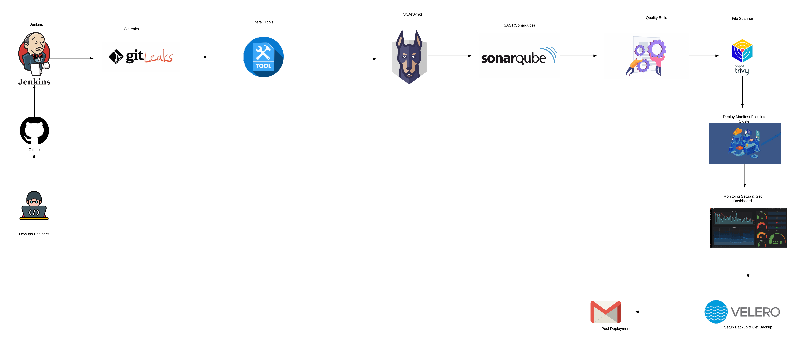
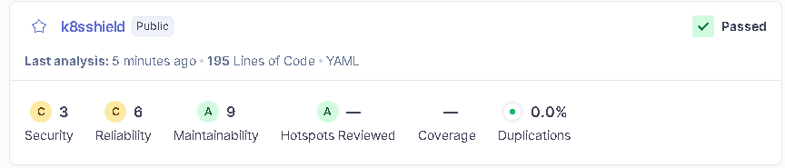
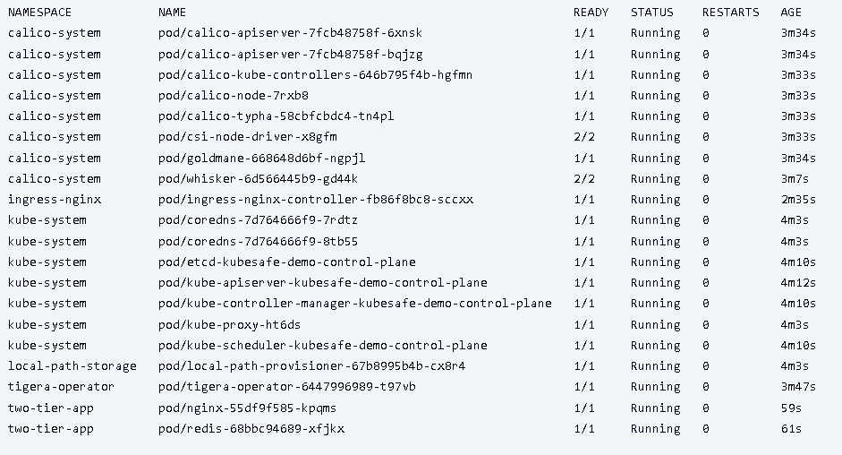

# 🛡️ K8sShield-Enterprise

A **production-grade DevSecOps pipeline** for a Two-Tier Application, demonstrating end-to-end security integration from code to deployment on Kubernetes.

[]()
[]()
[]()
[]()

---

## 📋 Overview

This project showcases a **complete DevSecOps pipeline** with multiple security scanning tools integrated at every stage—from secret detection to container vulnerability scanning—before deploying to a Kind Kubernetes cluster.

### **Key Highlights**

✅ **Multi-layer Security Scanning** (Secrets, SAST, SCA, Container)  
✅ **Zero-Trust Network Policies** with Calico  
✅ **RBAC-based Access Control**  
✅ **Automated Backup & Disaster Recovery** with Velero  
✅ **Full-Stack Monitoring** with Prometheus & Grafana  
✅ **CI/CD Automation** via Jenkins Pipeline

---

## 🏗️ Architecture & Pipeline Flow

<p align="center">
    
</p>

**Pipeline Stages:**

1. **Code Commit** → Trigger Jenkins Pipeline
2. **Secret Scanning** → Gitleaks detects hardcoded credentials
3. **SAST Analysis** → SonarQube analyzes code quality & vulnerabilities
4. **Dependency Scanning** → Snyk checks for vulnerable packages
5. **Container Build** → Docker image creation
6. **Image Scanning** → Trivy scans for OS/library vulnerabilities
7. **Deploy to K8s** → Kind cluster deployment with RBAC & Network Policies
8. **Backup Setup** → Velero configures automated backups
9. **Monitoring** → Prometheus & Grafana dashboards

---

## 🔧 Tech Stack

### **Application Layer**

```
Frontend:
└── Nginx              # Web Server & Reverse Proxy

Backend:
└── Redis              # In-Memory Database
```

### **DevOps & Infrastructure**

```
CI/CD:
├── Jenkins            # Pipeline Orchestration
├── Git/GitHub         # Version Control
└── kubectl            # Kubernetes CLI

Orchestration:
└── Kind               # Kubernetes in Docker (Local Development)
```

### **Security Tools (DevSecOps)**

```
Secret Scanning:
└── Gitleaks           # Detect hardcoded secrets in code

Dependency Scanning (SCA):
└── Snyk               # Software Composition Analysis

Code Quality (SAST):
└── SonarQube          # Static Application Security Testing

Filesystem Security:
└── Trivy              # Container & Filesystem Vulnerability Scanner

Network Security:
└── Calico             # Network Policies & Micro-segmentation

Access Control:
└── RBAC               # Role-Based Access Control (Kubernetes)

Backup & Disaster Recovery:
└── Velero + MinIO     # Kubernetes Backup & Restore with S3 Storage
```

### **Monitoring & Observability**

```
Metrics:
└── Prometheus         # Metrics Collection & Alerting

Visualization:
└── Grafana            # Dashboards & Analytics

Service Discovery:
└── ServiceMonitor     # Auto-discovery of application metrics
```

---

## 📊 Pipeline Results

### **Jenkins Pipeline View**

<p align="center">
    
</p>

### **SonarQube Security Report**

<p align="center">
    
</p>

### **Kubernetes Pods Running**

<p align="center">
    
</p>

---

## 📁 Project Structure

```
K8sShield-Enterprise/
├── backup/
│   └── backup.sh                     # Velero backup automation script
│
├── scripts/
│   ├── install-prereqs.sh            # Install Docker, Kind, kubectl & tools
│   ├── setup-cluster-and-policy.sh   # Setup Kind cluster with Calico
│   └── cleanup.sh                    # Clean up cluster & containers
│
├── monitoring/
│   ├── setup-monitoring.sh           # Deploy Prometheus & Grafana
│   └── nginx-servicemonitor.yml      # Nginx metrics monitoring
│
├── k8s-deploy/
│   ├── frontend-nginx-ds.yml         # Nginx deployment
│   ├── backend-redis-ds.yml          # Redis deployment
│   ├── ingress.yml                   # Ingress controller config
│   ├── network-policy.yml            # Calico network policies
│   └── rbac.yml                      # RBAC roles & bindings
│
├── Jenkinsfile                       # CI/CD pipeline definition
├── sonar-project.properties          # SonarQube configuration
├── README.md                         # Project documentation
└── assets/                           # Screenshots & diagrams
```

---

## 🚀 Quick Start - Automated Deployment

### **Option 1: Fully Automated (Recommended)**

For a **complete automated deployment** with all security tools integrated, use the Jenkins pipeline:

```bash
# The Jenkinsfile automates:
# ✓ Secret scanning with Gitleaks
# ✓ Code quality analysis with SonarQube
# ✓ Dependency scanning with Snyk
# ✓ Container scanning with Trivy
# ✓ Kubernetes deployment with RBAC
# ✓ Network policies with Calico
# ✓ Backup setup with Velero
# ✓ Monitoring with Prometheus & Grafana
```

**Steps:**

1. **Configure Jenkins** with required plugins (Git, Docker, Kubernetes)
2. **Create a Jenkins Pipeline Job** pointing to this repository
3. **Trigger the pipeline** - Everything runs automatically!
4. **Access the application** via the configured Ingress

---

### **Option 2: Manual Step-by-Step**

If you prefer manual execution, run scripts in this order:

```bash
# Step 1: Install prerequisites
./scripts/install-prereqs.sh

# Step 2: Setup Kind cluster with Calico network policies
./scripts/setup-cluster-and-policy.sh

# Step 3: Deploy application with RBAC
kubectl apply -f k8s-deploy/

# Step 4: Setup monitoring
./monitoring/setup-monitoring.sh

# Step 5: Configure backups
./backup/backup.sh

# Step 6: Verify deployment
kubectl get pods --all-namespaces
```

---

## 🔐 Security Features

| Feature                   | Tool               | Description                                            |
| ------------------------- | ------------------ | ------------------------------------------------------ |
| **🔍 Secret Detection**   | Gitleaks           | Scans code for hardcoded credentials, API keys, tokens |
| **📊 Code Quality**       | SonarQube          | SAST analysis for bugs, vulnerabilities, code smells   |
| **📦 Dependency Check**   | Snyk               | SCA for vulnerable npm/pip/maven packages              |
| **🐳 Container Scanning** | Trivy              | Scans Docker images for CVEs in OS & libraries         |
| **🛡️ Network Policies**   | Calico             | Zero-trust pod-to-pod communication control            |
| **🔐 Access Control**     | RBAC               | Fine-grained Kubernetes permissions                    |
| **💾 Backup & DR**        | Velero             | Automated cluster backups to MinIO S3                  |
| **📈 Monitoring**         | Prometheus/Grafana | Real-time metrics & alerting                           |

---

## 🛡️ Security Highlights

### **1. Zero-Trust Networking**

- Default-deny network policies with Calico
- Pod-to-pod communication whitelisting
- Namespace isolation

### **2. Hardened RBAC**

- Service accounts with minimal permissions
- Role-based access to specific resources
- No cluster-admin by default

### **3. Disaster Recovery**

- Automated daily backups with Velero
- MinIO S3-compatible storage backend
- One-click cluster restoration

### **4. Comprehensive Monitoring**

- Prometheus metrics collection
- Grafana dashboards for visualization
- ServiceMonitor for auto-discovery

### **5. Secure Ingress**

- Nginx Ingress Controller
- TLS/SSL termination ready
- Rate limiting & IP whitelisting capable

---

### **Pre-configured Dashboards**

- Kubernetes Cluster Metrics
- Nginx Performance Metrics
- Redis Database Metrics
- Node Resource Utilization

---

## 🧪 Testing

### **Verify Security Scans**

```bash
# Run Gitleaks locally
gitleaks detect --source . --verbose

# Run Trivy scan
trivy image nginx:latest

# Check SonarQube results
# Access SonarQube dashboard after pipeline run
```

### **Test Network Policies**

```bash
# Test pod-to-pod connectivity
kubectl run test-pod --image=busybox -it --rm -- sh
wget -O- http://nginx-service

# Should be blocked if not whitelisted
```

### **Test Backup & Restore**

```bash
# Create backup
velero backup create test-backup --include-namespaces=default

# Verify backup
velero backup get

# Restore from backup
velero restore create --from-backup test-backup
```

---

## 🐛 Troubleshooting

### **Common Issues**

**Issue 1: Jenkins pipeline fails at security scan stage**

```bash
# Solution: Ensure SonarQube/Snyk tokens are configured
# Check Jenkins credentials: Manage Jenkins → Credentials
```

**Issue 2: Pods not starting**

```bash
# Check pod status
kubectl get pods -A
kubectl describe pod <pod-name>

# Check network policies
kubectl get networkpolicies
```

**Issue 3: Velero backup fails**

```bash
# Check Velero logs
kubectl logs -n velero deployment/velero

# Verify MinIO connectivity
velero backup-location get
```

---

## 🤝 Contributing

Contributions are welcome! Please follow these steps:

1. **Fork the repository**
2. **Create feature branch**
   ```bash
   git checkout -b feature/AmazingFeature
   ```
3. **Commit your changes**
   ```bash
   git commit -m 'Add: AmazingFeature'
   ```
4. **Push to branch**
   ```bash
   git push origin feature/AmazingFeature
   ```
5. **Open Pull Request**

### **Contribution Guidelines**

- Follow existing code style
- Add tests for new features
- Update documentation
- Ensure all security scans pass

---

## 📝 License

This project is licensed under the **MIT License** - see the [LICENSE](LICENSE) file for details.

---

## 👨‍💻 Author

**Rahul Joshi**  
📧 Email: [17rahuljoshi@gmail.com](mailto:17rahuljoshi@gmail.com)  
🔗 GitHub: [@17J](https://github.com/17J)

---

## 🙏 Acknowledgments

- [Kubernetes Documentation](https://kubernetes.io/docs/)
- [Calico Project](https://www.tigera.io/project-calico/)
- [Velero Backup Tool](https://velero.io/)
- [Jenkins Community](https://www.jenkins.io/)
- DevSecOps Community

---

## ⭐ Show Your Support

Give a ⭐ if this project helped you learn DevSecOps!

---

**Built with ❤️ for the DevSecOps Community**
